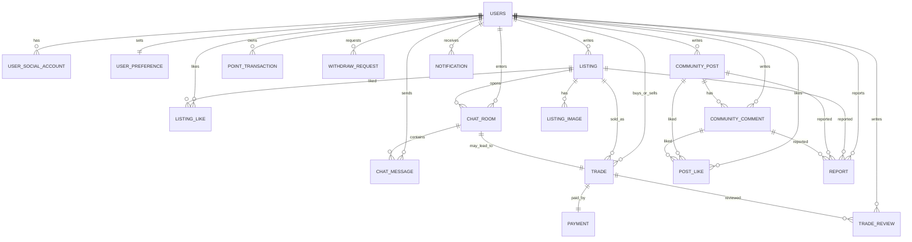

# RE:FORM 프로젝트용 최종 축소 설계

기준:
- 유스케이스 정의서 우선
- 경매 제외
- JWT/Redis 토큰 저장 제외
- AI 벡터 저장 제외
- 포트폴리오 프로젝트에서 직접 구현 가능한 수준으로 축소

## 최종 방향

이 버전은 `34개`에서 `18개`로 줄인 프로젝트용 최종안이다.

핵심 판단:
- 지역/종목/팀은 코드 테이블 없이 문자열 컬럼으로 처리
- 관심 설정은 별도 정규화 대신 `user_preferences` 1개로 통합
- 판매글 상태 이력, 거래 상태 이력은 제거하고 현재 상태만 저장
- AI 추천 결과와 AI 위험 탐지 결과도 각 도메인 테이블에 흡수
- 커뮤니티 좋아요는 공통 `post_like`로 단순화
- 포인트는 `활동 포인트`, `판매자 정산 포인트`만 유지하되 지갑/거래내역을 최소화

## 최종 테이블 18개

1. `users`
2. `user_social_account`
3. `user_preference`
4. `listing`
5. `listing_image`
6. `listing_like`
7. `chat_room`
8. `chat_message`
9. `trade`
10. `trade_review`
11. `payment`
12. `point_transaction`
13. `withdraw_request`
14. `community_post`
15. `community_comment`
16. `post_like`
17. `report`
18. `notification`

## 왜 이 정도가 적당한지

- 회원/소셜 로그인/프로필/관심설정 구현 가능
- 판매글/찜/채팅/거래/결제/후기 흐름 구현 가능
- 커뮤니티 CRUD/댓글/좋아요 구현 가능
- 신고/알림/관리자 기본 처리 연결 가능
- 엔티티 수가 아직 많아 보일 수 있지만, 실제 서비스 핵심 흐름은 대부분 유지된다
- 반대로 이보다 더 줄이면 거래/채팅/커뮤니티 중 하나가 과도하게 비정규화되어 구현 난도가 오히려 올라간다

## JPA 패키지 구조

```text
com.reform
├─ global
│  ├─ config
│  ├─ auth
│  ├─ common
│  │  ├─ entity
│  │  ├─ exception
│  │  ├─ response
│  │  └─ util
│  └─ infra
│     ├─ s3
│     ├─ toss
│     └─ ai
├─ domain
│  ├─ user
│  │  ├─ controller
│  │  ├─ service
│  │  ├─ repository
│  │  ├─ dto
│  │  └─ entity
│  ├─ listing
│  │  ├─ controller
│  │  ├─ service
│  │  ├─ repository
│  │  ├─ dto
│  │  └─ entity
│  ├─ chat
│  │  ├─ controller
│  │  ├─ service
│  │  ├─ repository
│  │  ├─ dto
│  │  └─ entity
│  ├─ trade
│  │  ├─ controller
│  │  ├─ service
│  │  ├─ repository
│  │  ├─ dto
│  │  └─ entity
│  ├─ payment
│  │  ├─ controller
│  │  ├─ service
│  │  ├─ repository
│  │  ├─ dto
│  │  └─ entity
│  ├─ community
│  │  ├─ controller
│  │  ├─ service
│  │  ├─ repository
│  │  ├─ dto
│  │  └─ entity
│  ├─ report
│  │  ├─ controller
│  │  ├─ service
│  │  ├─ repository
│  │  ├─ dto
│  │  └─ entity
│  └─ notification
│     ├─ service
│     ├─ repository
│     └─ entity
└─ admin
   ├─ controller
   ├─ service
   └─ dto
```

## 엔티티 배치 추천

- `domain.user.entity`
  - `User`
  - `UserSocialAccount`
  - `UserPreference`
- `domain.listing.entity`
  - `Listing`
  - `ListingImage`
  - `ListingLike`
- `domain.chat.entity`
  - `ChatRoom`
  - `ChatMessage`
- `domain.trade.entity`
  - `Trade`
  - `TradeReview`
- `domain.payment.entity`
  - `Payment`
  - `PointTransaction`
  - `WithdrawRequest`
- `domain.community.entity`
  - `CommunityPost`
  - `CommunityComment`
  - `PostLike`
- `domain.report.entity`
  - `Report`
- `domain.notification.entity`
  - `Notification`

## ERD



## 파일

- SQL: [reform_project_schema.sql](C:\Users\paulkim\Documents\Codex\2026-05-06\https-docs-google-com-document-d\reform_project_schema.sql)
